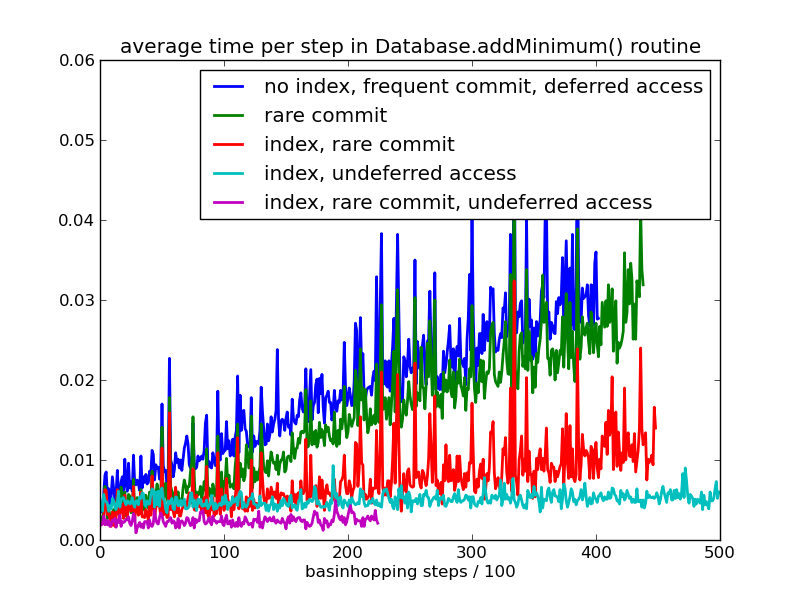

.. _database_performance:

Database Performance
--------------------

Pele uses the python package `sqlalchemy` to manage the database of minima and transition states.
By default this uses sqlite to store the database in a file on the hard drive.
This is very convenient for persistent storage of data and for easy access.
The downside is that without careful use it can be very slow.  
For most purposes it shouldn't cause a problem; this information about optimizing database performance should only be
useful if you're dealing with very large databases or are accessing the
database hundreds of times a second.  This should be considered an expert level tutorial.
Some of the possible things to watch out for are listed below.

Filter and sort on the database level
+++++++++++++++++++++++++++++++++++++
Try to minimize how many objects are retrieved from the database.
Do any filtering on the SQL level using `sqlalchemy` query commands.
For example::

    minima = db.session.query(Minimum).filter(Minimum.energy < 0).all()

is much faster than::

    minima = db.session.query(Minimum) # load all the minima
    minima = filter(lambda m: m.energy < 0, minima) # filter in python

Bulk inserts
++++++++++++

If you have lots of minima you want to add to the database all at once
it is much faster to do it all at once than one at a time.
For example, if you have a long list of energy and coordinates you can do
it the slow way::

    # loop through the minima adding them one at a time
    for e, coords in e_coords_list:
        mnew = Minimum(e, coords)
        db.session.add(mnew)
    db.session.commit()

or the fast way using bulk inserts::

    # make a list of dictionaries for the minima data
    minima_dicts = [] 
    for e, coords in e_coords_list:
        min_dict = dict(energy=e, coords=coords) 
        # you can add other data (e.g. fvib) to min_dict as well
        minima_dicts.append(min_dict)
    # add them to the database all at once
    self.db.engine.execute(Minimum.__table__.insert(), minima_dicts) 
    self.db.session.commit()

Loading of deferred data
++++++++++++++++++++++++

We have it set up so that some of the columns in the database (e.g.
`Minimum.coords` and other large objects) are deferred, which means that they
are only loaded from the database when they are actually accessed.
The upside is that the, possibly substantial, coordinate array need not be transferred from hard disk
to memory each time a minimum is accesses.  Code such as::

  for m in db.session.query(Minimum):
      print m.energy

runs slightly faster than it otherwise would.  

Deferring the `coords` has a significant downside, in that the database must be
queried for every minimum for which you want to access the `coords`.  The result
is that the following code::

  for m in db.session.query(Minimum):
      print m.coords

can be extremely slow if you are looping through a lot of minima.  If there are
10000 minima it will send 10001 queries to the database.  The more minima there
are the slower it will be.

Luckily the solution is easy.  You simply need to undefer the columns you want
to access in the original query.::

  from sqlalchemy.orm import undefer
  for m in db.session.query(Minimum).options(undefer("coords")):
      print m.coords

This results in only one query to the database.

Frequent committing
+++++++++++++++++++

Normally when you change the database using `sqlalchemy` the changes are made
in memory only.  The command `db.session.commit()` must be called to make
changes to the database on the hard drive.  If this is called extremely
frequently (hundreds of times a second) it can add up to significant overhead.
Again, the solution is easy: call `commit()` only after a sufficient number of
changes have accrued.

Searching via an attribute that is not indexed
++++++++++++++++++++++++++++++++++++++++++++++

SQL indices mean that an SQL search happens in logarithmic time rather than
linear time.  If you search via an attribute that is not indexed it can be slow
for large databases.  For example:: 

    db.session.query(Minimum).filter(Minimum.fvib > 100)

If you find yourself doing this often, you can manually add a filter
to your database.  In SQL this is::

    CREATE INDEX idx_minimum_fvib ON tbl_minima (fvib);

With `sqlalchemy` this would be::

    sqlalchemy.schema.Index('idx_minimum_fvib', Minimum.__table__.c.fvib)

Example
+++++++
As an example, the image below shows the mean time per step that is spent in the
`Database.addMinimum()` routine during a basinhopping run.  By the end of the run
the database has about 20000 minima in it.

The figure shows the effect of three variables.

1. Frequent commits (every step) vs rare commits (every 100th step).
This effect can be significant, but it does not grow with the size of the
database.
 
2. Having an SQL index on the energies of the minima.  To ensure we 
don't have duplicate minima in the database we search for minima within
an energy window.  The index really helps with scaling and keeps things fast
for large databases. Pele already has an energy index, so this is just for
example purposes.

3. Loading `coords` immediately via the `undefer` option.  If the energies are
similar the coordinates are checked to test whether two minima are the same.
If there are many minima with similar energy this is done multiple times.
Loading the deferred coordinate arrays takes more time for larger databases
where the number of minima with similar energy is greater.  Pele already uses
`undefer` in `Database.addMinimum()`, so this is just for example purposes.

These three effects can be important, but the actual time per call is still
very small.  You would need to do tens or hundreds of basinhopping steps a
second for any of this to become an important factor.  This will only be a problem for
for simple, or small systems.
