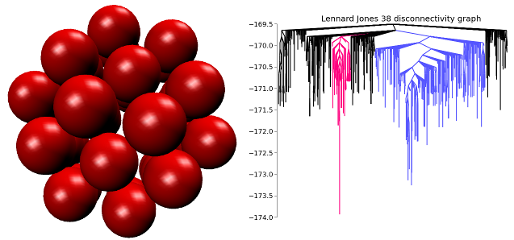

.. pele documentation master file, created by
   sphinx-quickstart on Wed Aug  1 03:04:59 2012.
   You can adapt this file completely to your liking, but it should at least
   contain the root `toctree` directive.

pele : Python Energy Landscape Explorer
=======================================

Tools for global optimization and energy landscape exploration.

Source code: https://github.com/pele-python/pele

Documentation: http://pele-python.github.io/pele/

pele is a package of tools for calculations
involving optimzation and exploration on energy landscapes.  The core
routines are broken into two parts: :ref:`Basinhopping <global_optimization>`,
for finding the global minimum of an energy landscape, and for building up
databases of minima.  And :ref:`DoubleEndedConnect <landscape_module>`, for
finding minimum energy paths on the energy landscape between two minima.  This
means paths that go through the geometric transition states.

Note that we use the language "energy landscape" because it's the language most
natural for our fields of physics and chemistry, but most of these tools are
equally applicable for working with any smooth scalar function in N dimensions.

  Images: The global minimum energy structure of a 38 atom Lennard-Jones cluster.  On
  the right is a disconnectivity graph showing a visualization of the energy
  landscape.  The competing low energy basins are shown in color.

Tutorials
-----------
.. toctree::
   :maxdepth: 3

   getting_started
   tutorial_potential
   system_class_tutorial

Reference
---------

.. toctree::
   :maxdepth: 2

   global_optimization

.. toctree::
   :maxdepth: 3

   landscape

.. toctree::
   :maxdepth: 2

   disconnectivity_graph

.. toctree::
   :maxdepth: 2

   gui

.. toctree::
   :maxdepth: 1

   database_performance

Modules
+++++++
.. toctree::
   :maxdepth: 1

   system_class
   quenching
   potentials
   landscape_module
   accept_tests
   database
   gui
   step_taking
   structure_alignment
   transition_states_module
   concurrent
   thermodynamics
   rates
   utils
   angleaxis_module

C++ documentation
+++++++++++++++++
`C++ Class Index <./doxygen/namespacepele.html>`_

Indices and tables
==================

* :ref:`genindex`
* :ref:`modindex`
* :ref:`search`

